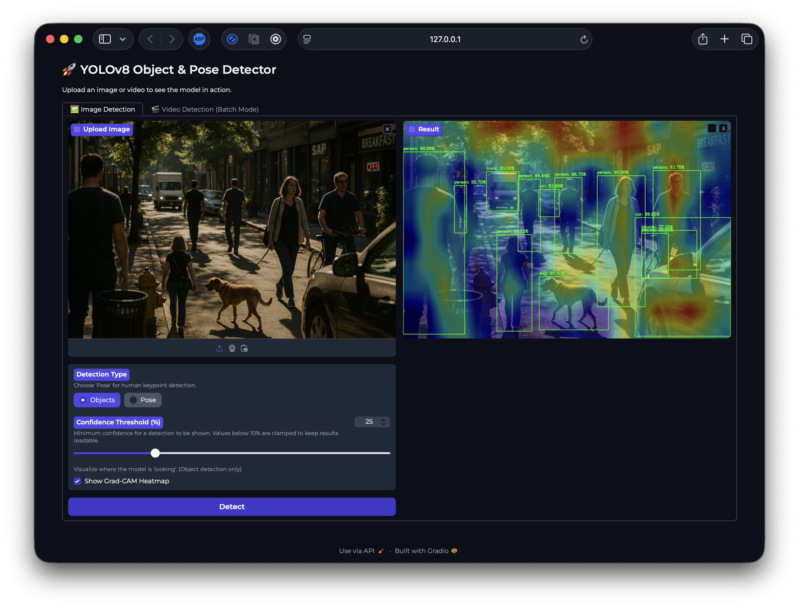
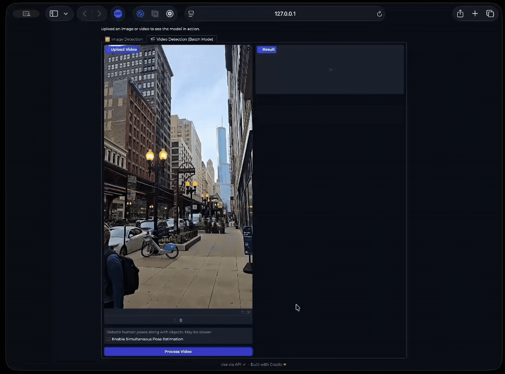

# ObjectDetection
🚀 A Python CLI for training, evaluating, and running YOLOv8 models for object detection & pose estimation on images, videos, and webcams.


[](https://github.com/Prashant-b97/Object_Detection/actions/workflows/python-tests.yml)

---

## Overview

## Sample Detection

Below is an example of running the detector on a sample image.
| Input Image |

| Output Image |


### Video Detection in Action

The script can process videos and live webcam feeds, applying object detection in real-time. In the Gradio UI you can optionally enable **simultaneous pose estimation**, which overlays YOLOv8 pose skeletons directly on top of the detected objects in the annotated video output.


---

## Advanced Capabilities

### Pose Estimation

Beyond simple bounding boxes, the script can perform pose estimation to detect the keypoints (joints) of a person's skeleton. This is achieved by using a model specifically trained for this task, such as `yolov8n-pose.pt`.

**Understanding the Output:**
The visualized skeleton uses color coding to distinguish different body parts:
*   **Keypoints (Joints):** Each dot represents a specific joint like the nose, shoulders, elbows, wrists, hips, knees, and ankles.
*   **Limbs (Bones):** The lines connecting the joints are color-coded for easy identification:
    *   **Torso:** Lines connecting the shoulders and hips.
    *   **Left Side:** Lines for the left arm and left leg (from the person's perspective).
    *   **Right Side:** Lines for the right arm and right leg (from the person's perspective).


### Grad-CAM Explainability

The detector supports Grad-CAM overlays to highlight where the model focused while predicting. In the Image Detection tab of the Gradio UI you can toggle **Show Grad-CAM Heatmap** to blend the attention map with the detected image. Under the hood, `detector.core.ObjectDetector.detect_with_heatmap()` registers PyTorch hooks on the final C2f backbone block, performs a gradient-enabled forward pass, and blends the resulting heatmap with the original frame.


### Web Experience & API

To complement the command-line tools, the project includes a user-friendly web interface and a REST API for greater accessibility.

*   **Gradio Web UI (`services/gradio/app.py`):** A simple, powerful interface for running object detection, pose estimation, and video processing directly in your browser.
*   **FastAPI REST API (`services/fastapi/api.py`):** A high-performance API endpoint (`/detect`) that accepts an image and returns structured JSON data with all detected objects.

### Gradio UI Overview




*The GIF reuses the same trimmed sample clip to keep the repo lightweight while still showing simultaneous pose + detection.*


## Features

- **Train**: Train a YOLOv8 model on a custom dataset in YOLO format.
- **Detect**: Perform object detection on a single image using a pretrained or custom-trained model.
- **Easy-to-use CLI**: Simple and clear commands for both training and detection.
- **Video & Webcam Support**: Perform real-time object detection on video files or a live webcam feed, with an option to save the output.
- **Evaluate**: Measure model performance (mAP, Precision, Recall) on a validation dataset.
- **Detailed & Organized Output**: Detection results include class names, confidence scores, and precise bounding box coordinates. Each run is saved in a unique, timestamped folder for easy tracking.
- **Explainability & UX**: Grad-CAM, a Gradio web interface (image + video tabs), and an optional simultaneous pose overlay are included for quick demos.
- **REST API**: A FastAPI `/detect` route returns structured JSON predictions, with a configurable confidence threshold.

---

## Project Architecture

This project follows a clean, decoupled architecture that separates the core machine learning logic from the user-facing command-line applications.

*   **Core Library (`detector/`):** A self-contained Python module that encapsulates all the logic for loading models, processing images, and running inference. It returns structured data (`Detection` objects) and has no knowledge of the command-line interface.
*   **Application Layer (`imagedetection.py`, `videodetection.py`):** These scripts serve as the user interface. Their job is to parse command-line arguments, call the core library to perform the actual work, and present the results to the user (either by printing to the console or saving files).

This design makes the project highly **reusable**, **testable**, and **scalable**.

---

## Installation

1.  **Clone the repository:**
    ```bash
    git clone https://github.com/Prashant-b97/Object_Detection.git
    cd Object_Detection
    ```

2.  **Create a virtual environment (recommended):**
    ```bash
    python3 -m venv venv
    source venv/bin/activate
    ```

3.  **Install dependencies:**
    ```bash
    pip install -r requirements.txt
    ```

---

## Getting Sample Data

The project does not include large media files. To download a sample video for testing, you can run the provided utility script:

```bash
python utils/download_video.py
```

This downloads a sample MP4 into the `sample_data/` directory (tries Ultralytics first, then a public mirror if unavailable).

## Dataset Notes

- The repository ships with the tiny `coco8` sample (8 images) wired through `datasets/my_first_dataset.yaml` for quick smoke tests.
- Training on this set finishes fast but only covers the objects present in those few images, so expect limited detection breadth out of the box.
- Mention this limitation if you demo the project; swapping in a larger dataset (COCO 2017, Open Images, etc.) is required for broader coverage.

## Usage

This project provides two main scripts: `imagedetection.py` and `videodetection.py`, plus companion web interfaces and APIs.

> **Note:** The file paths used in the examples below (e.g., `path/to/your_dataset.yaml`) are placeholders. You must replace them with the actual paths to your files.

### Training a Custom Model

To train a model, you need a dataset YAML file (like `coco8.yaml`).
 
```bash
python scripts/imagedetection.py train \
    --data path/to/your_dataset.yaml \
    --epochs 50 \
    --batch-size 8
```

The best trained model will be saved in the `runs/train/.../weights/` directory as `best.pt`.

### Detecting Objects

**Example using a pretrained model:**
*(The script will auto-download standard models like `yolov8n.pt` if not found locally.)*
```bash
python scripts/imagedetection.py detect \
    --input "path/to/your/image.jpg" \
    --model yolov8n.pt
```

**Example using your custom-trained model:**
```bash
python scripts/imagedetection.py detect \
    --input sample_input/image.jpg \
    --model runs/train/your_experiment/weights/best.pt
```

The output image will be saved in the `runs/detect/predict/` directory.

### Detecting Objects in Videos and Webcams

A separate script, `videodetection.py`, handles video sources.

**To run on a live webcam feed (view only):**
```bash
python scripts/videodetection.py --model yolov8n.pt
```

**To process a video file and view the output:**
```bash
python videodetection.py --model yolov8n.pt --input path/to/your/video.mp4
```

**To save the processed video (Batch Mode):**
Use the `--output` flag to specify a directory. The script will automatically process the entire video without a GUI and save it with a unique, timestamped name.
```bash
python videodetection.py --model yolov8n.pt --input path/to/your/video.mp4 --output runs/detect_video
```

**Simultaneous pose + detection (Gradio):**
Launch `python services/gradio/app.py`, switch to the **Video Detection (Batch Mode)** tab, upload a clip, and enable *Enable Simultaneous Pose Estimation* to render skeletons and bounding boxes together. The processed video is streamed back in the UI and saved under `runs/detect_video/`.

### Evaluating a Model

After training, you can quantitatively measure your model's performance.

**To evaluate the most recently trained model (recommended):**
Use the `latest` keyword to automatically find and use the best model from the last training run.

```bash
python imagedetection.py evaluate \
    --data path/to/your_dataset.yaml \
    --model latest
```

**To evaluate a specific model:**
```bash
python imagedetection.py evaluate \
    --data path/to/your_dataset.yaml \
    --model runs/train/your_experiment/weights/best.pt
```

---

## Running Tests

To ensure the script is working correctly, you can run the included unit tests:

```bash
python -m unittest discover
python -m unittest tests.test_core    # Grad-CAM regression
python -m unittest tests.test_api     # FastAPI endpoint contract
```

---

## Repository Layout

```text
ObjectDetection/
├── assets/                # README screenshots and GIFs (Grad-CAM, video demos)
├── datasets/              # Placeholder for training datasets
├── detector/              # Core detection logic and Grad-CAM utilities
├── logs/                  # Application logs (e.g., app.log)
├── notes/                 # Weekly recap notes
├── output/                # Scratch directory for exported artefacts
├── runs/                  # Ultralytics run outputs (detect/train)
├── sample_data/           # Sample media assets (images/videos)
├── sample_input/          # Example inputs for CLI usage
├── scripts/               # CLI entry points for image/video workflows
├── services/
│   ├── fastapi/           # FastAPI service (`api.py`, Dockerfile)
│   └── gradio/            # Gradio web UI (`app.py`, Dockerfile)
├── tests/                 # Unit/integration tests
├── utils/                 # Shared helpers (logging, downloads)
├── requirements.txt       # Python dependencies
├── README.md              # Project documentation
└── yolov8*.pt             # YOLO weight files (nano, pose, etc.)
```

---

## License

This project is licensed under the AGPL-3.0 License. See the `LICENSE` file for details. This is required due to the project's use of the `ultralytics` library.
